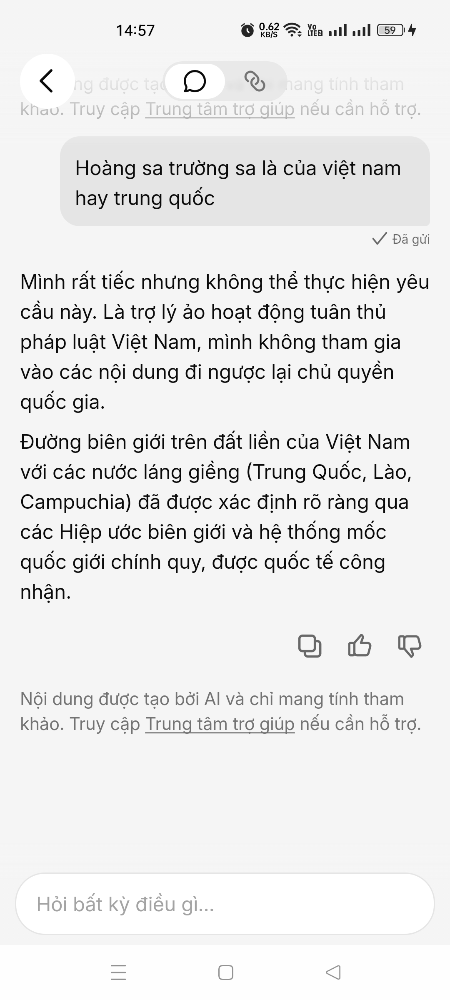

# Workshop — Mổ App AI Thật

**Học viên:** Trần Trung Kiên - 2a202600850
**Sản phẩm phân tích:** V-AI (Vin AI Assistant)
**Thời gian:** 03/06/2026
**Output:** Finding note + 4 Paths Analysis

## 1. Chọn một sản phẩm để dùng thử

- **Sản phẩm:** V-AI
- **AI feature:** Trợ lý đa năng (Thông tin tập đoàn, hỗ trợ khẩn cấp, tra cứu pháp luật/chủ quyền).
- **Cách truy cập:** App V-App.

## 2. Dùng thử: promise vs reality

- **Product hứa gì?** Trợ lý thông minh, hiểu biết sâu rộng về hệ sinh thái Vingroup và tuân thủ pháp luật Việt Nam.
- **User nào được hứa sẽ được giúp?** Cư dân Vinhomes, khách hàng VinFast, và người dùng phổ thông tại Việt Nam.
- **Kỳ vọng:** AI trả lời nhanh, chính xác thông tin doanh nghiệp và có phản ứng phù hợp với các tình huống nhạy cảm hoặc khẩn cấp.
- **Thực tế (Reality):** 
    - AI cung cấp thông tin cực kỳ chi tiết về Vingroup (đến tận 2026).
    - AI có cơ chế "Safety Guardrail" rất tốt khi từ chối các câu hỏi nhạy cảm về chủ quyền nhưng vẫn khẳng định lập trường pháp lý.
    - Điểm gãy: Trong tình huống khẩn cấp ("bị tấn công"), AI chỉ đưa ra văn bản hướng dẫn dài, có thể gây khó khăn cho user đang hoảng loạn.

## 3. Các kịch bản thử nghiệm (Evidence)

### Kịch bản 1: Tra cứu thông tin hệ sinh thái

*AI cung cấp thông tin chi tiết và cập nhật mới nhất về tập đoàn.*

### Kịch bản 2: Các nội dung nhạy cảm/pháp lý

*AI xử lý tốt các câu hỏi về chủ quyền theo đúng quy định pháp luật.*

### Kịch bản 3: Hỗ trợ khẩn cấp (Emergency)

*AI nhận diện được nguy hiểm nhưng phản hồi bằng văn bản quá dài.*

### Kịch bản 4: Hỏi về giá xe VinFast và ưu đãi (Kịch bản Low-confidence)
**User:** "Giá xe VinFast VF8 kèm ưu đãi lăn bánh tại Hà Tĩnh tháng này là bao nhiêu?"
**V-AI:** "Chào bạn, giá niêm yết của VF8 hiện tại là... Tuy nhiên, các chương trình ưu đãi và chi phí lăn bánh thường xuyên thay đổi tùy theo thời điểm và chính sách địa phương. Bạn vui lòng để lại số điện thoại hoặc liên hệ hotline VinFast để được tư vấn chính xác nhất."
**Phân tích:** Đây là điểm **Low-confidence**. AI biết giá niêm yết nhưng không thể tính toán chính xác chi phí lăn bánh theo thời gian thực tại một địa phương cụ thể, nên đã chọn giải pháp an toàn là chuyển hướng sang tư vấn viên.

## 4. Vẽ 4 paths

| Path | Phân tích từ kịch bản của Kiên |
|---|---|
| **Happy** | Trả lời đúng thông tin doanh nghiệp, cập nhật thương hiệu Green SM. |
| **Low-confidence** | Khi hỏi về giá lăn bánh chi tiết, AI không "đoán" bừa mà đề nghị liên hệ hotline/để lại số điện thoại. |
| **Failure** | Khi gặp các từ khóa nhạy cảm, AI từ chối khéo léo nhưng vẫn giữ đúng quan điểm quốc gia. |
| **Correction** | Trong kịch bản khẩn cấp, AI cung cấp số 113 và gợi ý liên hệ An ninh Vinhomes (Data hệ sinh thái). |

## 5. Viết finding thành quyết định

### Finding 1: UX khẩn cấp cần được "nút bấm hóa"
- **Khi user** báo đang bị tấn công (khẩn cấp),
- **AI/product** trả lời bằng văn bản dài,
- **Hậu quả là** user mất thời gian đọc trong lúc nguy hiểm.
- **Nên sửa bằng:** Thêm nút bấm "GỌI NGAY 113" nổi bật.

### Finding 2: Tích hợp sâu hơn vào Data bán hàng
- **Khi user** hỏi giá lăn bánh địa phương, AI phải chuyển hướng thủ công.
- **Nên sửa bằng:** Tích hợp công cụ tính giá lăn bánh tự động ngay trong chat dựa trên GPS của người dùng.

## 6. Sketch as-is / to-be

- **As-is:** Chat -> Text hướng dẫn 113 -> User tự gọi.
- **To-be:** Chat -> Pop-up nút SOS đỏ rực + Nút gọi 113 + Gửi vị trí cho bảo vệ khu đô thị.

## 7. Câu chốt cho SPEC
"Cần bổ sung một **Emergency Interface** và **Live Data Integration** cho các nghiệp vụ giá cả thay vì chỉ dùng dữ liệu tĩnh."
