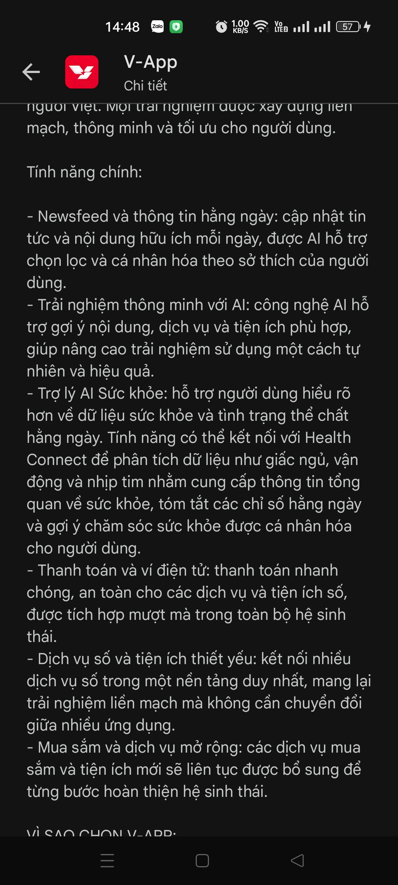
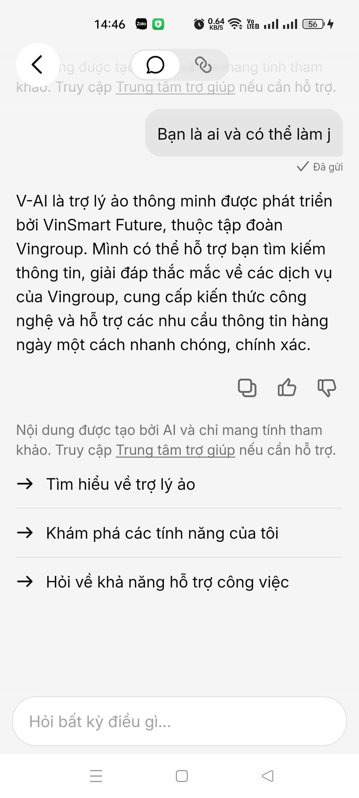

# Workshop — Mổ App AI Thật

**Học viên:** Trần Trung Kiên - 2a202600850  
**Sản phẩm phân tích:** V-AI (Vin AI Assistant)  
**Thời gian:** 03/06/2026  
**Output:** finding note + sketch `as-is / to-be`

Mục tiêu không phải chấm "UI đẹp hay xấu". Mục tiêu là dùng sản phẩm thật như một bài needfinding: tìm chỗ product gãy trong workflow thật, rồi viết finding đó thành quyết định product.

## 1. Chọn một sản phẩm để dùng thử

| Sản phẩm | AI feature | Cách truy cập |
|---|---|---|
| V-App — V-AI | Trợ lý đa năng, tra cứu thông tin hệ sinh thái, hỗ trợ khẩn cấp | App V-App |

## 2. Dùng thử: promise vs reality

- **Product hứa gì?** Một trợ lý ảo thông minh, tuân thủ pháp luật Việt Nam, cung cấp thông tin chính xác về hệ sinh thái Vingroup.
- **User nào được hứa sẽ được giúp?** Cư dân Vinhomes và người dùng các sản phẩm của Vin.
- **Bạn kỳ vọng AI làm được task nào?** Tra cứu thông tin tập đoàn nhanh chóng và hỗ trợ xử lý các tình huống khẩn cấp tại chỗ.
- **Khi dùng thật, điểm gãy xuất hiện ở đâu?** Trong tình huống khẩn cấp ("giúp tôi báo cảnh sát..."), AI phản hồi bằng một đoạn văn bản rất dài thay vì đưa ra các hành động ngay lập tức. User đang hoảng loạn sẽ không có thời gian để đọc hết hướng dẫn.

**Evidence (Bằng chứng):**
- **Screenshot Policy/Promise:** 
    
  *AI khẳng định tuân thủ pháp luật Việt Nam và bảo vệ chủ quyền.*
- **Screenshot Vingroup Info:** 
    
  *Dữ liệu rất chi tiết về doanh nghiệp đến tháng 4/2026.*

## 3. Vẽ 4 paths

| Path | Câu hỏi cần trả lời | Thực tế tại V-AI (Test bởi Kiên) |
|---|---|---|
| Happy | Khi AI đúng và tự tin, user thấy gì? | Khi hỏi "Vin group la", AI cung cấp data đầy đủ, cập nhật thương hiệu Green SM mới nhất (14/04/2026). |
| Low-confidence | Khi AI không chắc, hệ thống có hỏi lại không? | Khi hỏi về giá lăn bánh xe VinFast tại Hà Tĩnh, AI đưa ra mức giá niêm yết nhưng khuyên liên hệ hotline để có giá chính xác nhất tại địa phương. |
| Failure | Khi AI sai, user biết bằng cách nào? | Khi hỏi về chủ quyền nhạy cảm, AI từ chối theo Safety Guardrail: "Mình rất tiếc nhưng không thể thực hiện yêu cầu này...". |
| Correction | Khi user sửa, có được học lại không? | Trong kịch bản khẩn cấp, AI cung cấp số 113 và hướng dẫn liên hệ an ninh Vinhomes (Dựa trên context người dùng là cư dân). |

## 4. Viết finding thành quyết định

**Finding 1: UX khẩn cấp chưa tối ưu cho tình huống sinh tử**
- **Khi user** [gặp nguy hiểm và báo "giúp tôi báo cảnh sát"],
- **AI/product** [phản hồi bằng văn bản hướng dẫn dài 4-5 dòng],
- **Hậu quả là** [user mất thời gian đọc và tự thao tác gọi điện, tăng rủi ro trong lúc hoảng loạn].
- **Lỗi thuộc layer:** UX Recovery.
- **Nên sửa bằng:** Thêm nút bấm "SOS — GỌI 113" và "GỌI AN NINH" trực tiếp trong giao diện chat khi nhận diện được intent nguy hiểm.

**Finding 2: Dữ liệu hệ sinh thái rất "tươi" và tin cậy**
- **Khi user** [hỏi về các thông tin mới nhất của doanh nghiệp],
- **AI/product** [trả lời kèm dẫn nguồn và ngày cập nhật mới nhất (tháng 4/2026)],
- **Hậu quả là** [tăng độ tin cậy và giá trị sử dụng cho người dùng trong hệ sinh thái].
- **Lỗi thuộc layer:** Data-tool (Good).

## 5. Sketch as-is / to-be

- **As-is:** 
  1. User: "giúp tôi báo cảnh sát..." 
  2. AI: (Hiện đoạn text dài) "Nếu bạn gặp nguy hiểm, hãy gọi ngay 113... Nếu ở Vinhomes gọi an ninh..."
  3. User: Phải tự thoát app, mở bàn phím, bấm 113.
  
- **To-be:** 
  1. User: "giúp tôi báo cảnh sát..."
  2. AI: (Hiện Warning đỏ) + **[NÚT GỌI 113]** + **[NÚT GỌI AN NINH VINHOMES]**
  3. User: Bấm 1 chạm để gọi ngay lập tức.

## 6. Tự kiểm trước khi nộp

- [x] Có ít nhất 1 screenshot hoặc observation cụ thể.
- [x] Có đủ 4 paths.
- [x] Finding được viết thành product decision.
- [x] Sketch có as-is và to-be.
